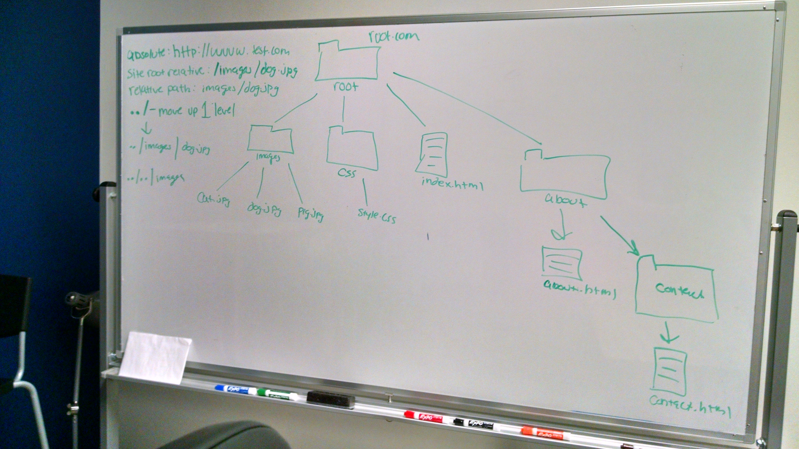

# HTML Structural Elements and CSS Specificity

#### Notes:
- Check-in on how HW went
- Debugging HW
- HTML Structural Elements
    + div
    + header
    + nav
        * nav structure
    + section
    + article
    + aside
    + footer
    + forms
- CSS Selectors/Specificity
    + Element
    + Descendent 
    + Parent/Direct Child (>)
    + General Siblings (~)
    + Direct Siblings (+)
    + Pseudo Classes
        * Hover
        * Active
        * Focus
        * Visited
    + Pseudo Elements
        * ::before
        * ::after
    + Universal Selectors
        * *
- Paths
    + Absolute
    + Site Root Relative
    + Document Relative
    + ../
- Box-Sizing: Border-Box
- Codepens from class:
    + [CSS Selectors](http://codepen.io/abbylarner/pen/qOWBWd)
    + [HTML5 Elements](http://codepen.io/abbylarner/pen/MaggPq)
    + [Positioning vs Margin and Alt Tag](http://codepen.io/abbylarner/pen/Qbeeed)
- [HTML entities](http://dev.w3.org/html5/html-author/charref)
- [TIY Breadcrumbs](http://tiy.breadcrumbsqa.com/)
- 

#### Reading/Video Assignments
- [Writing Better CSS](http://adamkaplan.me/blog/write-better-css/)
- [Principles of writing idiomatic, consistent CSS](https://github.com/necolas/idiomatic-css)
- [What the ../?](http://900dpi.com/blog/Learn-HTML/What-the-Everything-you-ever-wanted-to-know-about-paths-on-the-web)
- [Specifics on CSS Specificity](https://css-tricks.com/specifics-on-css-specificity/)

#### High Trek Site - Small Format 
- [Details](assignments/high-trek-sm.md)

#### Design Critique
- Find one example of a website that has good design and be ready to defend the your decision

#### Additional Resources/Reading
- [What's the Deal With display: inline-block?](http://designshack.net/articles/css/whats-the-deal-with-display-inline-block/)
- [All About Floats](https://css-tricks.com/all-about-floats/)
- [HTML Element Reference](https://developer.mozilla.org/en-US/docs/Web/HTML/Element)
- [CSS Reference](https://developer.mozilla.org/en-US/docs/Web/CSS/Reference)

