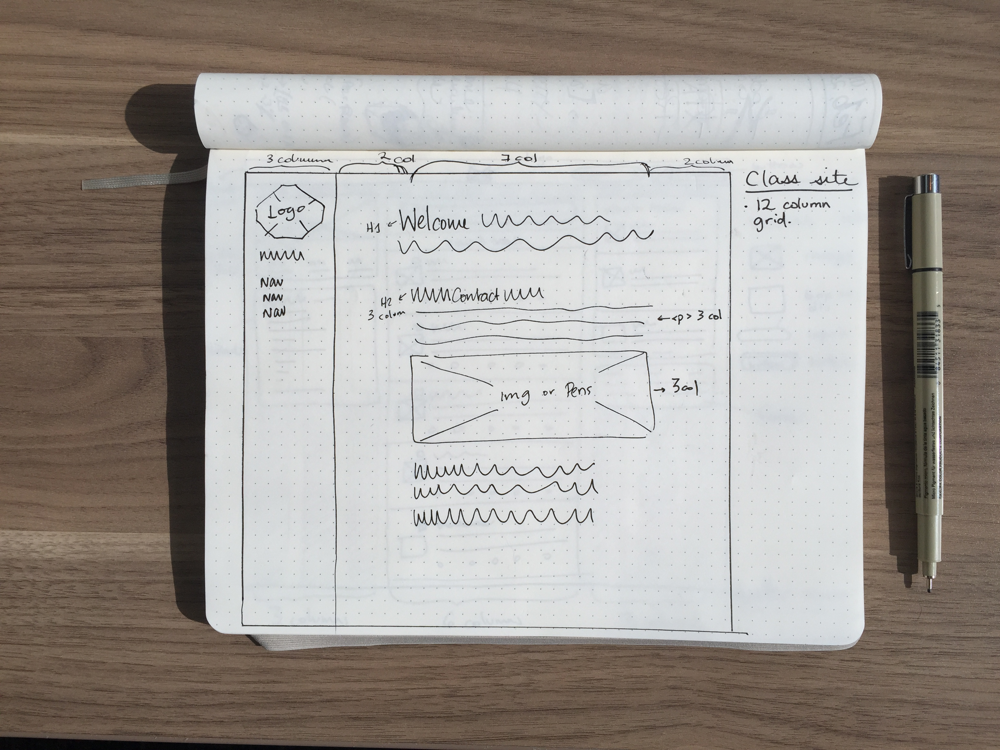
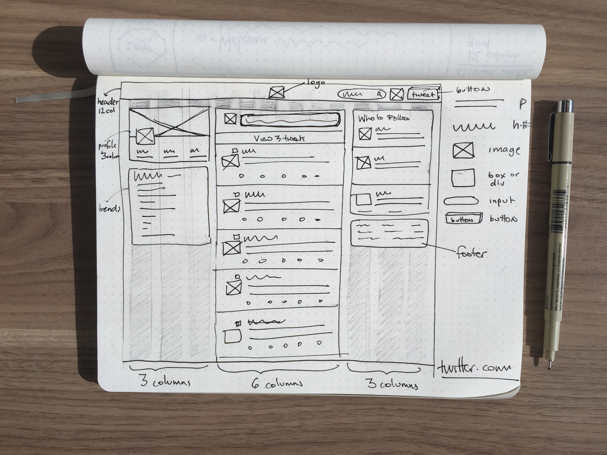

#### Description
A big part of your process is going to be sketching website layouts to figure out the best possible interaction for your users.  This is a very important _first_ step before you jump into design or code.  Sketching allows you to get all of your ideas on paper, and while you want to try to be neat, you don't have to be perfect (no rulers necessary!).  Make sure to include the grid columns, type of grid, and enough information so that a person with no context would understand the elements in your sketch. Also, make sure to include how many coluns the grid has.

Here's an example of a good sketch, and an example of a bad sketch:

#### Bad Example
Not a lot of detail, it’s hard to see the grid throughout the whole image, not a lot of labeling of sections. 

#### Good Example
A lot of detail, lots of labeling, including the name or address of the website. Grid columns are noticeable.  

Use the following sites to create your sketches:
- [Mashable](http://mashable.com/)
- [Penguin](http://www.penguin.com/)
- [Dribble](https://dribbble.com/designers)
- [New York Times](http://www.nytimes.com/)
- [Github](https://github.com/abbylarner)
- [RetailMeNot](http://www.retailmenot.com/)
- [Art of the Menu](http://www.underconsideration.com/artofthemenu/)
- [Amazon Roomba](http://www.amazon.com/gp/product/B005GK3IVW/ref=ox_sc_act_title_1?ie=UTF8&psc=1&smid=ATVPDKIKX0DER)
- [Stripe](https://stripe.com/docs)
- [The Touch Agency](http://www.thetouchagency.co.uk/)

#### Objectives
- Be able to recognize a grid on the web
- Be able to create detailed sketches of websites
- Understand sketching grids and layouts

#### Performance Objectives
- Be able to sketch a web layout

#### Details
Deliverables

- Use one page for each sketch, take a photo, and push it to Github in your tiy_assignments folder
