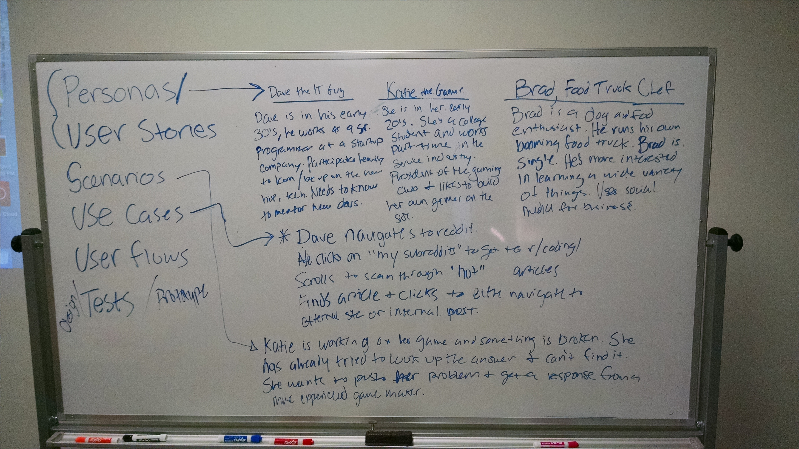
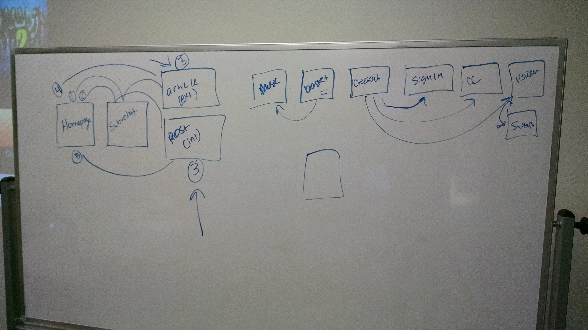

# Intro to UX Design

####Notes
- Used to be that we made decisions based on what we thought the client wanted and what we thought looked good, there was no data backing up the decisons
- Now we are moving more into user-centered design
- Although many people think usability and UX are the same, they aren't
    + UX addresses how a user feels when using a system, while usability is about the user-friendliness and efficiency of the interface.
- The user experience is made up of all the interactions a person has with your brand, company, or organization

- What does a UX Designer Do?
    + Research
        * Subjective Research
            - “What is your favorite color?”
            - “Do you trust this company?”
            - “Do I look nerdy in these glasses”?
        * Objective Research
            - “How long did you spend using our app?”
            - “Where did you find the link to our site?”
            - “How many people visited our website today?”
        * Sample Size: the more people the better
    + Testing
        * Hypothesize
        * Design
            - What are you testing? 
            - What are the answers you are trying to solve?
            - What are the customer segments you need to test on?
        * Types
            - User Interviews
                + 3 Basic Types of questions:
                    * Open - “How would you describe me?” 
                    * Leading - "What are my nerdiest features"?
                    * Closed/Direct - "What is prettier my hair or my eyes"?
            - User Tests
                + Give users tasks and figure out where they get stuck (what can you optimize?)
            - A/B and Multivariate Testing
                + Create different versions of a test, serve them up to different user segments to see how they react
        * Analyze:
            - Tools
                + Monetate
                + Optimizely
                + Adobe Test and Target
                + Google Analytics 
                + Peek (http://peek.usertesting.com/)
                + UserTesting
    + Wireframes
        * Wireframes are developed to prototype distribution of existing site content for testing and iteration before the graphic interface and code are developed.
    + Personas
        * ARE NOT:
            - Personality types
            - Demographics
            - Characters in your “brand story”
            - Stereotypes based on your experience
            - Shallow or 1-dimensional
            - Concepts
            - Predictions
        * They describe the goals, expectations, motivations, and behaviour of real people. Why do they come to your site? What are they looking for? What makes them nervous?
        * http://thehipperelement.com/post/72447829343/daily-ux-crash-course-6-of-31
    + User Stories
        * A User Story describes one possible path a user can take on your site or app. It should be short, but complete. You will need many user stories to describe your whole design.
        * Notice that the user story identifies who the user is, what she needs, and why she needs it.
        * User Stories: Establish Requirements in plain english, drive user research, provide the freedom to create within constraints (gives a starting point), demonstrate value clearly
        * http://thehipperelement.com/post/72874272820/daily-ux-crash-course-10-of-31
    + Scenarios
        * Scenarios
            - A user scenario expands upon your user stories by including details about how a system might be interpreted, experienced, and used.
            - https://www.newfangled.com/how-to-tell-the-users-story/
    + Use Cases
        * A use case is really just a long list of steps a user might take in trying to get something done. 
    + User Flows
        * A form of visual documentation that illustrates how users encounter your website’s content, as well as the sequence of their interactions once they get there. This is where your stories, scenarios and cases can be mapped out in a way that applies more directly to information architecture and user interface design decisions.
- Process:
    + http://uxmastery.com/resources/process/
    + http://www.centerline.net/insights/user-experience-design-process-infographic/
    + Business Goals
    + Information architecture
    + Content development and wireframing
    + Testing
- UX Deliverables
    + http://uxdesign.cc/ux-methods-deliverables/

- http://uxmag.com/content/comic-the-ux-designer-paradox
- http://www.mprove.de/script/00/upa/_media/upaposter_85x11.pdf

- In class case study:
    + 
    + 

#### Reading/Video Assignments
- [What is User Experience Design](http://www.smashingmagazine.com/2010/10/what-is-user-experience-design-overview-tools-and-resources/)
- [What does it mean to be simple](http://52weeksofux.com/post/21026021557/what-does-it-mean-to-be-simple)
- [UX Treasure Map](http://semanticstudios.com/user_experience_deliverables/)
- [Elements of User Experience](http://www.jjg.net/elements/pdf/elements.pdf)
- [User Centered Design](http://paznow.s3.amazonaws.com/User-Centred-Design.pdf)
- [How to Tell the User's Story](https://www.newfangled.com/how-to-tell-the-users-story/)
- [Why I Love User Stories](http://www.usabilitycounts.com/2013/10/11/why-i-love-user-stories/)

#### User Study of 3 Websites
- [Details](assignments/user-studies.md)

#### Additional Resources/Reading
- [UX Mag](http://uxmag.com/)
- [UX Booth](http://www.uxbooth.com/)
- [52 Weeks of UX](http://52weeksofux.com/tagged/week_1)
- [Dark Patterns](http://darkpatterns.org/)
- [What does a UX Designer Actually Do](http://www.sitepoint.com/ux-designer-actually/)
- [Good Patterns](http://thehipperelement.com/post/72691840090/daily-ux-crash-course-8-of-31)
- [The Difference Between a Multivariate Test and an A/B Test](https://www.optimizely.com/resources/multivariate-test-vs-ab-test/)
- [The Ultimate Guide to A/B Testing](http://www.smashingmagazine.com/2010/06/the-ultimate-guide-to-a-b-testing/)

